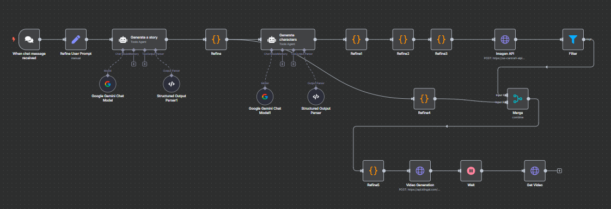

# PGC-Workflow

An automated **Platform Generated Content (PGC)** creation workflow built in [n8n](https://n8n.io).  
It takes a user’s text prompt, refines it into a detailed and structured description with consistent characters, generates AI images, and stitches them together into a short video.

## 🚀 Features
- **Prompt Refinement** – Converts a simple user prompt into a rich, detailed, and character-consistent description.
- **AI Image Generation** – Creates high-quality images based on the refined prompt.
- **Character Consistency** – Ensures that characters and visual elements remain consistent across all generated images.
- **Automated Video Creation** – Stitches generated images into a short, cohesive video file.
- **End-to-End Automation** – No manual editing required from text to video.

## 📥 How to Import into n8n

1. **Open n8n** in your browser or desktop app.
2. Click **"New Workflow"**.
3. In the top right menu (⋮), select **"Import from File"**.
4. Select the `.json` file from the `workflows/` folder of this repository.
5. Click **"Execute Workflow"** to test.
